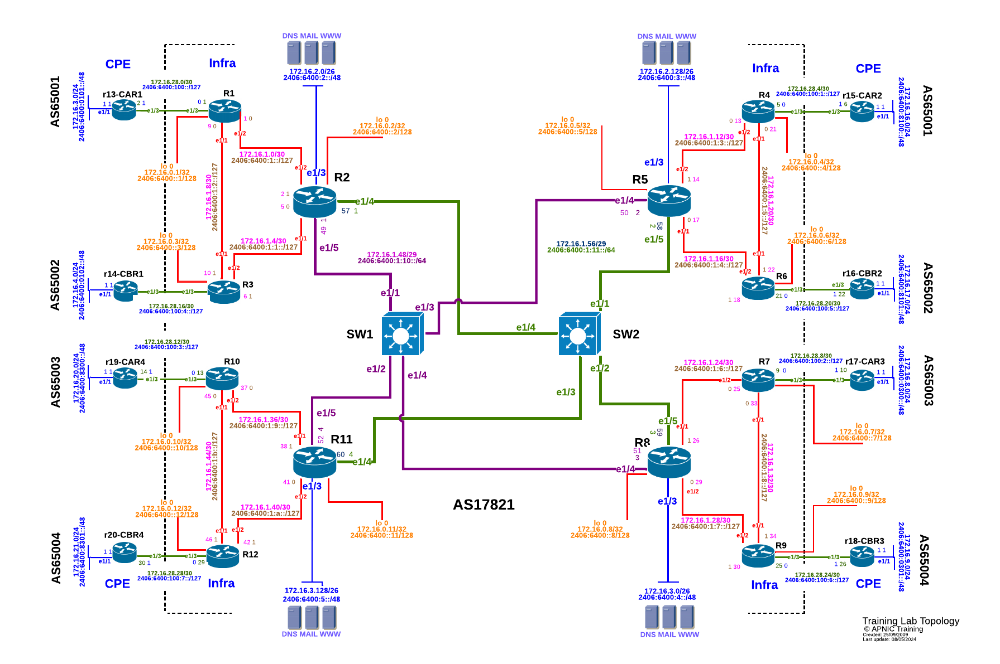

# Module 6 - MPLS L2 VPN Pseudowires
## Topology introduction:
-	The topology below shows 4 regional networks comprised of a core POP and 2 aggregation POPs (edge routers).
-	Edge routers aggregate downstream customers.
-	The regional networks are interconnected with redundant transport links.



<div style="page-break-after: always;"></div>

## Lab Tasks

OSPF and LDP are both configured.  
You will now configure an L2VPN With Psuedowires
WE will be pairing up with the following end-points

1. r13-CAR1 to r15-CAR2 [Traffic from R13 E1/3 to R15 E1/3, Capture R1 E1/3 & R4 E1/3] (GREEN)
2. r14-CBR1 to r16-CBR2 [Traffic from R14 E1/3 to R16 E1/3, Capture R3 E1/3 & R6 E1/3] (RED)
3. r19-CAR4 to r17-CAR3 [Traffic from R19 E1/3 to R17 E1/3, Capture R10 E1/3 & R7 E1/3] (BLUE)
4. r20-CBR4 to r18-CBR3 [Traffic from R20 E1/3 to R18 E1/3, Capture R12 E1/3 & R9 E1/3] (BLACK)

<div style="page-break-after: always;"></div>

## Lab Exercise
### Step 1 - Change IP addresses:

We will need to remove some of the configuration that we have, namely the IP addressing between the PE and CE routers on interface E1/3

```
conf t
int Ethernet 1/3
no ip address
no ipv6 address
```
We will also assign a new IP address to the E1/3 Interface on the CE Routers as per the following table:

|   Router  |   IP Address    |   Subnet        |
|-----------|-----------------|-----------------|
|   R13     |   10.10.1.1/30    |   10.10.1.0/30 |
|   R15     |   10.10.1.2/30    |   10.10.1.0/30 |
|   R14     |   10.10.1.5/30    |   10.10.1.4/30 |
|   R16     |   10.10.1.6/30    |   10.10.1.4/30 |
|   R19     |   10.10.1.9/30    |   10.10.1.8/30 |
|   R17     |   10.10.1.10/30   |   10.10.1.8/30 |
|   R20     |   10.10.1.13/30   |   10.10.1.12/30|
|   R18     |   10.10.1.14/30   |   10.10.1.12/30|

Here is an example for `R17`

```
conf t
int e1/3
ip address 10.10.1.5/30
```

### Step 2 - Configure the Pseudowires

We will now configure the PW service on the PE Routers
_You should already have removed the IP address configurations on E1/3 towrards the CE routers_


Here is an example Configuration for R7 

```
mpls ldp
pseudowires
      pseudowire R17-R19
         neighbor 172.16.0.10
         pseudowire-id 1
         mtu 9000

```
In the Above we are adding the pseudowires configuration to the `mpls ldp` stanza.

We give the PW context a name and specify the Neighbour Loopback address (in this case it is R10)
we then give the PW an ID.  **The needs to be the same on both sides of the connection**

We will now "Connect" the interfaces together.  In Arista EOS, this is done through the use of a `patch panel`.

Think of this as a virtual patch panel to connect interfaces togehter

the following configuration is for `r1`:

```
patch panel
   patch r1-r4
      connector 1 interface Ethernet1/3
      connector 2 pseudowire ldp R13-R15
```
In the Above we are entring the `patch panel` stanza.<BR>
We then give the patch a name and specifiy the 2 end points of the patch cable.<BR>
`connector 1` is our physical interface and `connector 2` is the PW circuit we specified earlier.

Once completed you can view the status of your PW circuits.<BR>
`show patch panel` 

Expected Output
```
Patch Connector                          Status Last Change
----- ---------------------------------- ------ -----------
r1-r4 1: Ethernet1/3                     Up     0:08:09 ago
      2: LDP neighbor 172.16.0.4 PW ID 1
```

`show patch panel detail` 

Expected Output
```
PW Fault Legend:
   ET-IN - Ethernet receive fault
   ET-OUT - Ethernet transmit fault
   TUN-IN - Tunnel receive fault
   TUN-OUT - Tunnel transmit fault
   NF - Pseudowire not forwarding (other reason)

Patch: r1-r4, Status: Up, Last change: 0:08:52 ago
   Connector 1: Ethernet1/3
      Status: Up
      Error disable trigger: remote not forwarding
   Connector 2: LDP neighbor 172.16.0.4 PW ID 1
      Status: Up
      Local MPLS label: 116384, Group ID: 0x0
         MTU: 9000, 802.1Q VLAN request sent: -
         Flow label capability: none
         Supported VCCV CV types: LSP ping
         Supported VCCV CC types: Router alert label
      Neighbor MPLS label: 100000, Group ID: 0x0
         MTU: 9000, 802.1Q VLAN request received: -
         Flow label capability: none
         Supported VCCV CV types: LSP ping
         Supported VCCV CC types: Router alert label
      PW type: 5 (raw), Control word: N
      Flow label used: no
      Tunnel type: LDP, Tunnel index: 3
```

`show patch panel forwarding`

Expected Output
```
Legend:
   * - Not forwarding
   Type - Pseudowire type: 4 (tagged)
                           5 (raw)
   CW - Control word used
   FL - Flow label used

 In/Out                                  Source   Type   Flags   Patch
--------------------------------------- -------- ------ ------- -------
 Et1/3                                                           r1-r4
   172.16.0.4, Label 100000, LDP Tun 3   LDP         5

 PW Label   Out     Source   Type   Flags   Patch
---------- ------- -------- ------ ------- -------
 116384     Et1/3   LDP         5           r1-r4

```


### Step 3 - Verify Reachability:

Make sure you can reach (ping) from your respective CE Routers


***
