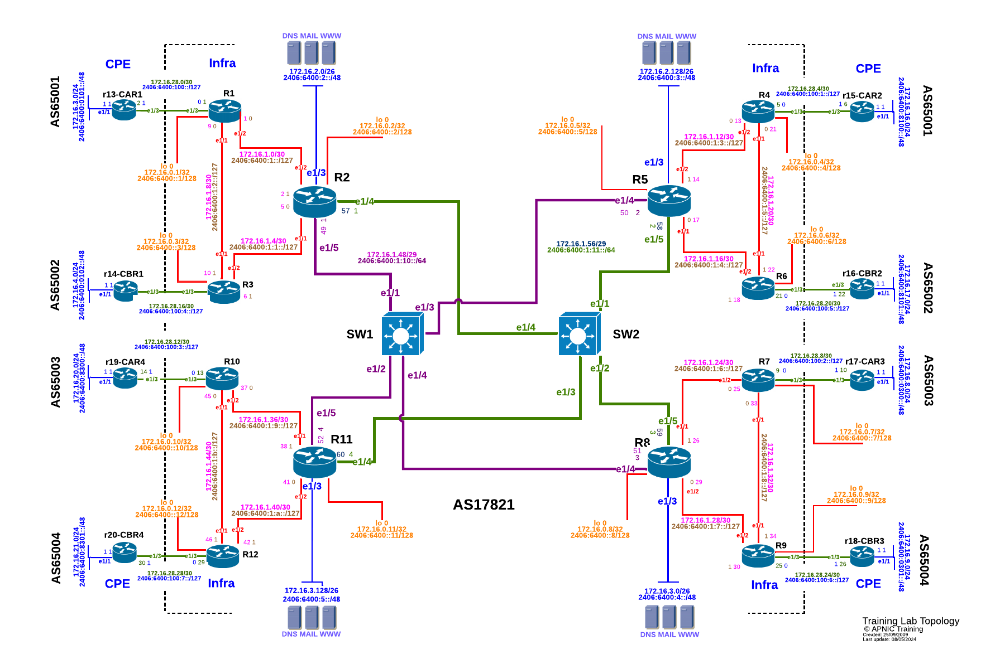

# Module 9 - VPLS L2 VPN
## Topology introduction:
-	The topology below shows 4 regional networks comprised of a core POP and 2 aggregation POPs (edge routers).
-	Edge routers aggregate downstream customers.
-	The regional networks are interconnected with redundant transport links.



<div style="page-break-after: always;"></div>

## Lab Tasks

OSPF and LDP are both configured.  
You will now configure an L2VPN With Psuedowires and VPLS
We will be splitting the lab into 2 VPLS Domains.


1. R13-R16 will make up VPLS domain 1
2. R17-R20 Will make up VPLS domain 2

<div style="page-break-after: always;"></div>

## Lab Exercise
### Step 1 - Change IP addresses:

We will need to remove some of the configuration that we have, namely the IP addressing between the PE and CE routers on interface E1/3, as well as the VRF on the PE Side.
```
conf t
int Ethernet 1/3
no ip address
no ipv6 address
no VRF RXX-XXXXX

```
on the `PE` Routers we will need to change the mode of the interface towards the CE (`E1/3`)
Choose a VLAN ID(I have chosen 101) for your interface (It will be an access port in this case)

```
conf t
vlan 101
interface Ethernet 1/3
switchport
switchport access vlan 101
```

We will also assign a new IP address to the `E1/3` Interface on the `CE` 
Routers as per the following table:


|   Router  |   IP Address    
|-----------|-----------------|
|   R13     |   10.10.1.1/24    |
|   R14     |   10.10.1.2/24    |
|   R15     |   10.10.1.3/24    |
|   R16     |   10.10.1.4/24    |
|   R17     |   10.10.2.1/24    |
|   R18     |   10.10.2.2/24   |
|   R19     |   10.10.2.3/24   |
|   R20     |   10.10.2.4/24   |

Here is an example for `R19`

```
conf t
int e1/3
ip address 10.10.2.3/24
```

### Step 2 - Configure the Pseudowires

We will now configure the PW service on the PE Routers.  THis will be similar in config to to the previous Lab
_You should already have removed the IP address configurations on E1/3 towrards the CE routers and set the port mode and VLAN_ID_


Here is an example Configuration for `R9`(connections will need to be made for R7, R10 and R12)

```
mpls ldp
pseudowires
      pseudowire R7
         neighbor 172.16.0.7
         pseudowire-id 1
         mtu 1500
      pseudowire R10
         neighbor 172.16.0.10
         pseudowire-id 1
         mtu 1500
      pseudowire R12
         neighbor 172.16.0.12
         pseudowire-id 1
         mtu 1500

```
In the Above we are adding the pseudowires configuration to the `mpls ldp` stanza.

We give the PW context a name and specify the Neighbour Loopback address (in this case it is R7,R10, and R12)
we then give the PW an ID.  **The needs to be the same on both sides of the connection**

If you still have the `patch panel` configuration from the previous lab, we will remove that now:

```
conf t
no patch panel
```

Now we can configure the VPLS.  The following is an example for `R7`

```
router vpls
   vpls domain-2
      ldp mac withdrawal trigger interface
      !
      vlan 101
      !
      pseudowire ldp mesh-2 split-horizon
         pseudowire R10
         pseudowire R12
         pseudowire R9
```

In the Above, we are intiating the VPLS instance.<BR>
We give the vpls section a name (`domain-2`)<BR>
`ldp mac withdrawal trigger interface` is telling the instance, that if the physical interface to the CE is dropped, then the router will withdraw the MAC address for the CE.<BR>
Next we are adding the PW circuits into the Mesh.

View the status of the VPLS connections

`show vpls`

Expected output (Example from R12)
```
r12#sh vpls
VPLS: domain-2
VLAN: 101, 802.1Q tag: -
MAC withdrawal trigger for local interface going down: Y
Pseudowire group: mesh-2, split-horizon
MAC withdrawal trigger on pseudowire failure: N
MAC withdrawal propagation: locally triggered
LDP neighbor 172.16.0.7 PW ID 1 PW name R7
   Status: No remote, Interface: Pseudowire1.0
LDP neighbor 172.16.0.9 PW ID 1 PW name R9
   Status: Up, Interface: Pseudowire2.0
LDP neighbor 172.16.0.10 PW ID 1 PW name R10
   Status: Up, Interface: Pseudowire3.0
```


### Step 3 - Verify Reachability:

Make sure you can reach (ping) from your respective CE Routers

We can also check the ARP table on CE routers.

`sh arp`

Expected output from R18

```
r18#sh arp
Address         Age (sec)  Hardware Addr   Interface
10.10.2.1         0:22:40  aac1.ab9a.5855  Ethernet1/3
10.10.2.3         0:06:41  aac1.ab1f.3e91  Ethernet1/3
10.10.2.4         0:01:17  aac1.abe1.f2a0  Ethernet1/3
```

<BR><BR>

***
